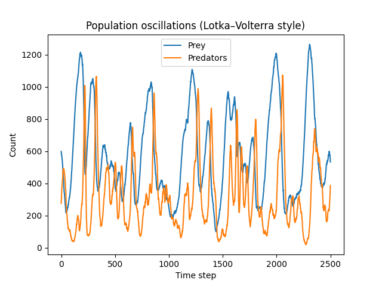
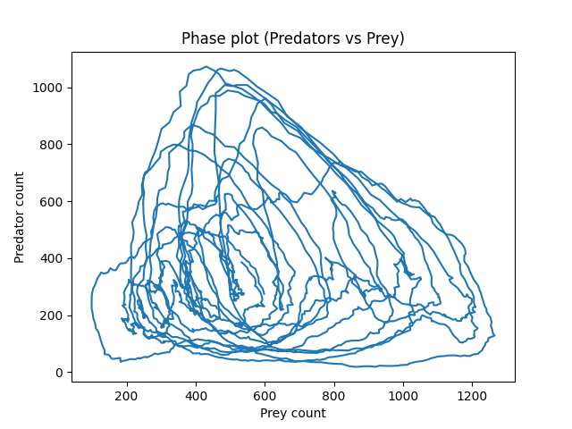
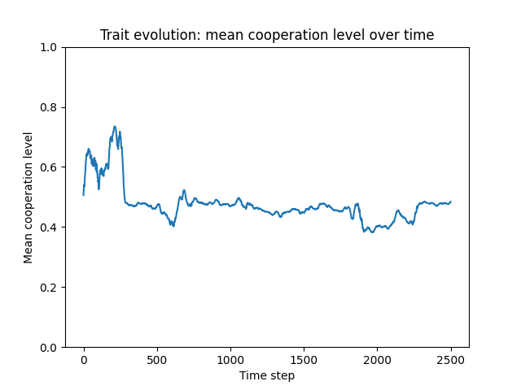
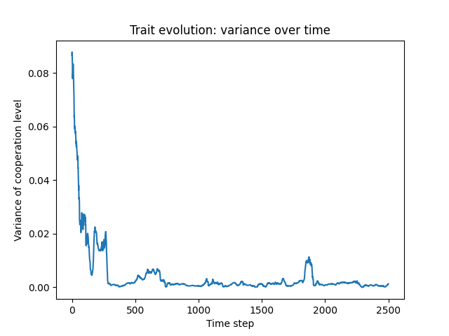
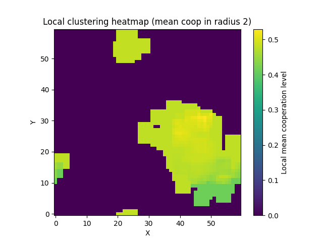
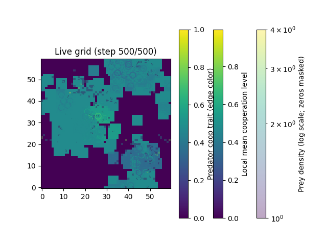
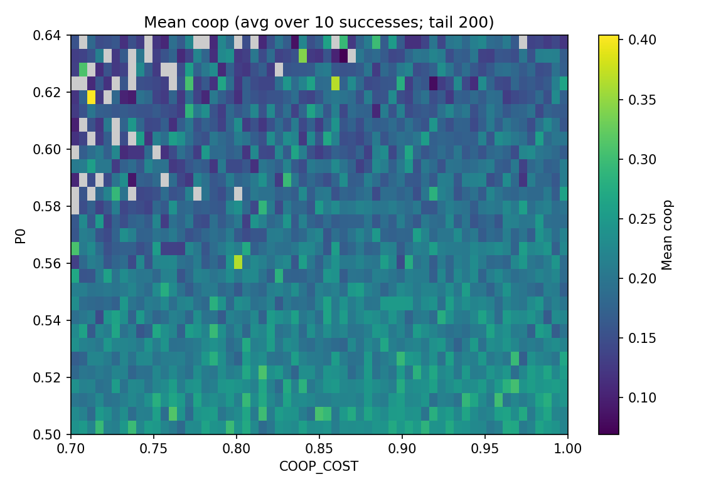
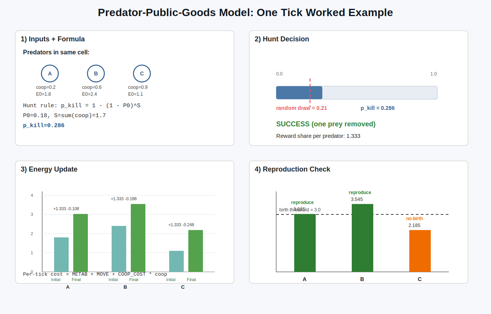
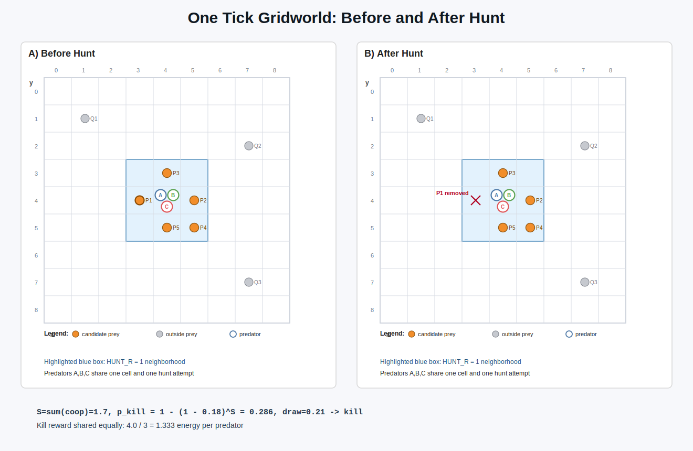

# Predator--Prey Cooperation Model Results

## With Formal Evolutionary Interpretation

This document summarizes the current predator--prey cooperation results
and provides a theoretical interpretation using:

- Hamilton's Rule (kin assortment framing)
- Multilevel Selection
- Price Equation
- Public Goods Game Structure
- Spatial Assortment

## Contents

1. Ecological Dynamics
2. Evolutionary Dynamics
3. Hamilton's Rule Interpretation
4. Multilevel Selection Perspective
5. Price Equation Formulation
6. Spatial Assortment
7. Public Goods Game Structure (Current Implementation)
8. Trait Reference View (Selected Chart)
9. Adaptive Parameter Sweep (`COOP_COST` x `P0`)
10. Interpretation of the Full System
11. Visualization Notes
12. Reproduction of Results
13. Key Parameter Settings
14. Next Directions
15. Mathematical Derivation (Current Reward Rule)
16. Simulation Logic (Code-Level)
17. One-Tick Worked Example (Visual)
18. Comparison vs MARL Stag-Hunt (Updated)
19. Hendry (2017) Links to This Model
20. Three Concrete Experiments (Ready to Run)

------------------------------------------------------------------------

# 1. Ecological Dynamics

## Population Oscillations

<p align="center">
  
</p>

Observed in the current chart:

- Predator and prey counts oscillate over the full run.
- Cycles are irregular in period and amplitude.
- Peaks are lagged (prey rises are typically followed by predator rises).

This is consistent with spatially perturbed Lotka--Volterra-like coupling.

## Phase Plot (Predators vs Prey)

<p align="center">
  
</p>

Observed in the current chart:

- The phase path forms nested and crossing loops (not a single closed orbit).
- Dynamics remain bounded but noisy.
- The system shows persistent oscillatory coupling rather than immediate collapse.

------------------------------------------------------------------------

# 2. Evolutionary Dynamics

## Trait Evolution: Mean Cooperation



Observed in the current chart:

- Mean cooperation starts near 0.5.
- It rises transiently (around 0.7), then declines.
- Long-run behavior stays in an intermediate band (roughly 0.43-0.52).

This run does not show fixation at 1.0.

## Trait Variance

<p align="center">
  
</p>

Observed in the current chart:

- Variance drops quickly early in the run.
- It remains low with occasional transient spikes.

This indicates concentration around an intermediate trait region, not full
collapse to a pure 1.0-cooperation state.

------------------------------------------------------------------------

# 3. Hamilton's Rule Interpretation

Let cooperation level be trait `c`.

Hamilton's inequality in reduced form is:

`r b > c`

where:

- `r` is local assortment/relatedness-like structure,
- `b` is the marginal group benefit from additional contribution,
- `c` is the individual cost of contribution.

In this model:

- Local birth and movement structure can keep positive assortment.
- Benefit saturation is controlled by the hunt function via `P0`.
- Per-tick cooperation cost (`COOP_COST * coop_expr`) provides direct individual
  cost (`coop_expr=coop` when plasticity is off).

Because `b` is state-dependent (group composition and `P0`), the net selection
gradient is not globally positive. That matches the observed intermediate regime.

------------------------------------------------------------------------

# 4. Multilevel Selection Perspective

A standard decomposition is:

$$
\Delta \bar{z}=\frac{\mathrm{Cov}_g(W_g,z_g)}{\bar{W}}+\frac{\mathbb{E}_g\left[\mathrm{Cov}_i(W_i,z_i)\right]}{\bar{W}}
$$

Interpretation for this system:

- Between-group component: more cooperative local groups can convert prey
  encounters into energy more reliably.
- Within-group component: each individual pays its own cooperation cost while
  reward is shared at group level.

This naturally allows mixed outcomes where cooperation is maintained but does
not necessarily fix at 1.0.

------------------------------------------------------------------------

# 5. Price Equation Formulation

At population level:

$$
\Delta \bar{z}=\frac{\mathrm{Cov}(W,z)}{\bar{W}}+\frac{\mathbb{E}\left[W\,\Delta z_{\mathrm{transmission}}\right]}{\bar{W}}
$$

With mutation, spatial turnover, and ecological fluctuations, the covariance term
can be positive in some states and weak/negative in others.

Empirically, the current trajectory is consistent with:

- sustained nonzero covariance favoring cooperation early,
- followed by an interior regime where costs and saturated benefits balance.

------------------------------------------------------------------------

# 6. Spatial Assortment

## Local Clustering Heatmap

<p align="center">
  
</p>

Observed in the current chart:

- Predators occupy clustered patches rather than a uniform field.
- Many dark regions are predator-empty neighborhoods.
- Occupied patches show intermediate-to-high local cooperation values.

## Live Grid Snapshot

<p align="center">
  
</p>

Observed in the current snapshot:

- Predator trait colors are mostly mid-range.
- Prey density and predator occupancy are spatially heterogeneous.
- Spatial structure and trait structure are visibly coupled.

------------------------------------------------------------------------

# 7. Public Goods Game Structure (Current Implementation)

The implemented hunt rule is trait-based public sharing among local hunters:

- Hunters are assembled locally around each prey candidate.
- A hard gate requires coop-weighted hunter power to exceed prey energy.
- In `energy_threshold_gate` mode, success is additionally probabilistic:
  `p_kill = 1 - (1 - P0)^sum(coop)`.
- On success, captured prey energy is transferred to hunters (no fixed
  synthetic kill reward).
- Reward split mode is configurable:
  - `ALLOW_FREE_RIDING=True`: equal split (free-riding possible).
  - `ALLOW_FREE_RIDING=False`: contribution-weighted split.
- Each predator still pays its own cooperation cost every tick.

This creates a social-dilemma-like tension:

- Group performance improves with higher total contribution.
- Individual marginal incentive can weaken as group contribution grows.

That mechanism is compatible with stable intermediate cooperation.

## Textbook PGG Mapping (Code Anchors)

The model is not a one-shot matrix game, but its hunt module maps cleanly to
public-goods components:

| Public-goods element | Current model implementation |
|---|---|
| Players in a group | Predators in the local hunter pool around a focal prey (`HUNTER_POOL_R`) |
| Individual contribution | `w_i = energy_i * [COOP_POWER_FLOOR + (1-COOP_POWER_FLOOR)*coop_i]` |
| Public good production | Team power is aggregated and compared to prey energy (hard gate); optional extra probabilistic gate via `P0` |
| Private contribution cost | Per-tick individual cost `COOP_COST * coop_expr_i` (plus general metabolic/move costs, with `coop_expr_i=coop_i` if plasticity is off) |
| Group benefit size | Captured prey energy `E_prey` on successful hunt |
| Benefit sharing rule | Equal split when `ALLOW_FREE_RIDING=True`; contribution-weighted when `ALLOW_FREE_RIDING=False` |
| Free-rider channel | Under equal split, low contributors can receive more reward share than contribution share |
| Evolutionary update | No learning policy; trait `coop` is inherited with mutation at reproduction |

Interpretation:

- This is a spatial, repeated, ecological public-goods game with endogenous
  group formation and resource-coupled payoffs.
- It is public-goods-like in mechanism, but richer than canonical static PGG
  because survival, prey dynamics, grass, and reproduction feed back into payoffs.

## Theory-to-Code Map (Intro Literature)

| Reference | Main idea | Where it appears in this model |
|---|---|---|
| Hamilton (1964) | Inclusive-fitness style tradeoff (`r b > c`) | `c`: per-step private cost `COOP_COST * coop_expr` (`coop_expr=coop` if plasticity is off); `b`: higher local hunt success/payoff via coop-weighted team power; `r`-like structure: local neighborhoods (`HUNT_R`, `HUNTER_POOL_R`) |
| Nowak (2006) | Rules for cooperation (especially spatial reciprocity) | Local interaction structure drives cooperative clustering and hunt outcomes; cooperation remains trait-based (`coop`) rather than action/learning based |
| Okasha (2006), Frank (1998) | Multilevel / Price-style decomposition | Between-group proxy: local group hunt conversion; within-group proxy: private cooperation costs and split-gap diagnostics (`low_contrib_overpay`, `high_contrib_underpay`) |
| Hendry (2017) | Eco-evolutionary feedbacks | Ecology: grass->prey->predator energy flows plus decay; evolution: inherited `coop`, mutation (`MUT_RATE`, `MUT_SIGMA`), selection via survival/reproduction |
| Perc et al. (2017) | Statistical-physics framing of cooperation, especially public-goods and spatial pattern dynamics | Public-goods hunt mechanics, spatial neighborhoods, stochastic update order, and phase-like regime changes across parameter sweeps |

This map is intentionally conceptual: the code is an ecological ABM, not an
analytical closed-form model, but each theoretical construct has a direct
mechanistic counterpart in the implementation.

------------------------------------------------------------------------

# 8. Trait Reference View (Selected Chart)

<p align="center">
  
</p>

This selected reference chart shows:

- an early transient increase,
- then long-run intermediate cooperation,
- with no terminal drop-to-zero event in this figure.

------------------------------------------------------------------------

# 9. Adaptive Parameter Sweep (`COOP_COST` x `P0`)

Sweep outputs currently used here are in `predprey_public_goods/images/`.
Metric per cell: mean cooperation over tail window, averaged across successful runs.

## Round 1 (broad scan)

<p align="center">
  
</p>

Observed pattern:

- Co-existence of predators and prey emerges at various mean cooperation
- Highest mean cooperation appears at low `COOP_COST`, low `P0`.
- Cooperation generally decreases as either `COOP_COST` or `P0` increases.
- Gray regions indicate cells without enough successful runs.

## Round 2 (high-cost/high-`P0` refinement)

<p align="center">
  
</p>

Observed pattern:

- Cooperation is mostly low-to-moderate in this region.
- Local stochastic pockets exist, but no broad high-cooperation band appears.

## Round 3 (moderate-`P0`, lower-cost refinement)

<p align="center">
  
</p>

Observed pattern:

- Cooperation is generally higher than in Round 2.
- A broad intermediate band (roughly 0.35-0.55) is visible, with local peaks.

Important limit of interpretation:

- These heatmaps do not identify a single minimum cooperation threshold needed
  for coexistence.
- They summarize cooperation levels in successful finite-horizon runs; they are
  not direct equilibrium-threshold maps.

------------------------------------------------------------------------

# 10. Interpretation of the Full System

Current combined evidence supports:

- persistent predator--prey oscillations,
- non-fixating intermediate cooperation in the baseline trait trajectory,
- spatial clustering that shapes both ecology and selection,
- parameter-dependent cooperation regimes in sweep analysis.

The system is best interpreted as state-dependent selection under ecological
feedbacks, rather than a globally monotonic drive to full cooperation.

------------------------------------------------------------------------

# 11. Visualization Notes

Core ecology/trait figures are generated from:

- `predprey_public_goods/emerging_cooperation.py`

Sweep figures are generated from:

- `predprey_public_goods/sweep_coop_cost_p0.py`

Animation views:

- Disentangled 3-panel live view (`ANIMATE=True`):
  panel 1 local cooperation heatmap,
  panel 2 prey density heatmap (log-scaled, zeros masked),
  panel 3 predator trait map (positions colored by cooperation),
  each with its own legend/colorbar.
- Optional simple live grid (`ANIMATE_SIMPLE_GRID=True`):
  grass heatmap background with prey and predator markers.
- Optional macro-flow figure (`PLOT_MACRO_ENERGY_FLOWS=True`):
  per-tick channels
  `photosynthesis->grass`, `grass->prey`, `prey->predator`,
  `prey->decay`, `predator->decay`,
  plus cumulative energy stocks per tick
  (`grass`, `prey`, `predator`, and total sum).

------------------------------------------------------------------------

# 12. Reproduction of Results

From repo root:

```bash
./.conda/bin/python predprey_public_goods/emerging_cooperation.py
./.conda/bin/python predprey_public_goods/sweep_coop_cost_p0.py
```

Notes:

- Sweep images are saved under `predprey_public_goods/images/`.
- Baseline plots are shown interactively unless you add explicit save logic.
- For deterministic baselines, set `SEED` in
  `predprey_public_goods/emerging_cooperation.py`.

------------------------------------------------------------------------

# 13. Key Parameter Settings

Defaults in `predprey_public_goods/emerging_cooperation.py`:

- Grid: `W=60`, `H=60`
- Initial populations: `PRED_INIT=100`, `PREY_INIT=500`
- Predator initial energy: `PRED_ENERGY_INIT=1.7`
- Steps: `STEPS=2500`
- Predator costs: `METAB_PRED=0.052`, `MOVE_COST=0.008`, `COOP_COST=0.4`
- Predator reproduction: `BIRTH_THRESH_PRED=4.2`, `PRED_REPRO_PROB=0.08`,
  `PRED_MAX=800`, `LOCAL_BIRTH_R=1`
- Mutation: `MUT_RATE=0.03`, `MUT_SIGMA=0.08`
- Hunt: `HUNT_RULE="energy_threshold_gate"`, `HUNT_R=1`,
  `HUNTER_POOL_R=1`, `P0=0.4`, `COOP_POWER_FLOOR=0.35`,
  `ALLOW_FREE_RIDING=True`
- Optional plasticity (default off, pure nature preserved):
  `ENABLE_PLASTICITY=False`, `PLASTICITY_STRENGTH=0.25`,
  `PLASTICITY_RATIO_SETPOINT=4.0`, `PLASTICITY_RATIO_SCALE=2.0`
- Logging: `LOG_REWARD_SPLIT=True`, `LOG_ENERGY_BUDGET=True`,
  `ENERGY_LOG_EVERY=1`, `ENERGY_INVARIANT_TOL=1e-6`
- Prey: `PREY_MOVE_PROB=0.25`, `PREY_REPRO_PROB=0.058`, `PREY_MAX=3200`,
  `PREY_ENERGY_MEAN=1.1`, `PREY_ENERGY_SIGMA=0.25`, `PREY_ENERGY_MIN=0.10`,
  `PREY_METAB=0.05`, `PREY_MOVE_COST=0.01`, `PREY_BIRTH_THRESH=2.0`,
  `PREY_BIRTH_SPLIT=0.36`, `PREY_BITE_SIZE=0.24`
- Grass: `GRASS_INIT=0.8`, `GRASS_MAX=3.0`, `GRASS_REGROWTH=0.055`
- Clustering radius: `CLUST_R=2`

Defaults in `predprey_public_goods/sweep_coop_cost_p0.py`:

- `COOP_COST` range: `0.00-1.00` (step `0.01`)
- `P0` range: `0.00-1.00` (step `0.01`)
- `successes=10`, `max_attempts=100`, `tail_window=200`, `steps=1500`
- Adaptive defaults: `adaptive=False`, `rounds=3`, `top_k=5`,
  `refine_step_factor=0.5`

------------------------------------------------------------------------

# 14. Next Directions

- Add an explicit coexistence probability map (`Pr[survival to T]`) alongside
  mean cooperation maps.
- Track and report extinction boundary curves in (`COOP_COST`, `P0`) space.
- Estimate effective assortment `r(t)` directly from local trait correlation.
- Compare single-seed trajectories against multi-seed confidence intervals.
- Add optional deterministic export pipeline for baseline figures.

------------------------------------------------------------------------

# 15. Mathematical Derivation (Current Reward Rule)

This section summarizes the implemented hard-gate reward logic.

For a candidate prey `v` and local hunter set `g`:

- Expressed cooperation trait:
  `c_j^expr(t) = clamp01(c_j + Delta_plast(t))`
- Trait sum: `S_g = sum_{j in g} c_j^expr(t)`
- Cooperative power:
  `P_g = sum_{j in g} e_j * [alpha + (1 - alpha) c_j^expr(t)]`
  with `alpha = COOP_POWER_FLOOR`
- Captured prey energy: `E_v`

Plasticity shift (optional, deterministic, trait-based):

- If `ENABLE_PLASTICITY=False`: `Delta_plast(t)=0`
- If `ENABLE_PLASTICITY=True`:
  `Delta_plast(t)=PLASTICITY_STRENGTH * tanh((prey/pred - setpoint)/scale)`

Gate 1 (hard constraint):

`P_g >= E_v`

Gate 2 (probabilistic success in `energy_threshold_gate` mode):

`p_kill(S_g) = 1 - (1 - p0)^(S_g)`

If both gates pass, captured prey energy is distributed:

- Equal split mode (`ALLOW_FREE_RIDING=True`):
  `G_i = E_v / n_g`
- Contribution-weighted mode (`ALLOW_FREE_RIDING=False`):
  `G_i = E_v * w_i / sum_{j in g} w_j`,
  with `w_i = e_i * [alpha + (1 - alpha) c_i]`

Per-tick predator cost:

`C_i = METAB_PRED + MOVE_COST + COOP_COST * c_i^expr(t)`

A local fitness proxy under gate mode is therefore:

`W_i ~ I(P_g >= E_v) * p_kill(S_g) * G_i - C_i`

Because benefits are both thresholded and saturating while costs are linear in
`c_i`, interior cooperation regimes remain expected.

## Compact Equations (Code Variable Names)

For predator `i` in local hunter set `g`:

`coop_expr_i = clamp01(coop_i + Delta_plast(t))`

`w_i = energy_i * [COOP_POWER_FLOOR + (1 - COOP_POWER_FLOOR) * coop_expr_i]`

`W_g = sum_{i in g} w_i`

`S_g = sum_{i in g} coop_expr_i`

For prey with energy `E_prey`:

`p_kill = 0, if W_g < E_prey`

`p_kill = 1, if HUNT_RULE == "energy_threshold" and W_g >= E_prey`

`p_kill = 1 - (1 - P0)^(S_g), if HUNT_RULE == "energy_threshold_gate" and W_g >= E_prey`

On successful capture:

`E_pool = E_prey`

`gain_i = E_pool / n_hunters`, if `ALLOW_FREE_RIDING=True`

`gain_i = E_pool * w_i / sum_{j in g} w_j`, if `ALLOW_FREE_RIDING=False`

Per-step predator private cost:

`cost_i = METAB_PRED + MOVE_COST + COOP_COST * coop_expr_i` (applied via clamped drains)

Core macro flow channels per tick:

`photosynthesis_to_grass = grass_regen`

`grass_to_prey = sum(bite_i)`, with `bite_i = min(PREY_BITE_SIZE, grass_cell_i)`

`prey_to_predator = sum(E_prey over successful kills)`

`prey_to_decay = prey_metab_loss + prey_move_loss`

`predator_to_decay = pred_metab_loss + pred_move_loss + pred_coop_loss`

Energy-balance identity checked each tick:

`delta_total = grass_regen - (prey_to_decay + predator_to_decay) + residual`

with `residual` expected near zero (tracked against `ENERGY_INVARIANT_TOL`).

Cumulative stock view (net balance in plots):

`E_grass(t) = sum(grass[y, x])`

`E_prey(t) = sum(prey.energy)`

`E_predator(t) = sum(predator.energy)`

`E_total(t) = E_grass(t) + E_prey(t) + E_predator(t)`

------------------------------------------------------------------------

# 16. Simulation Logic (Code-Level)

This section documents the exact update order used in
`predprey_public_goods/emerging_cooperation.py`.

## State Variables

- Predator agent: `(x, y, energy, coop)` where `coop in [0,1]`.
- Prey agent: `(x, y, energy)`.
- Grass field: per-cell energy `grass[y, x]`.
- Space is a wrapped torus (`wrap`), so movement beyond an edge re-enters on
  the opposite side.

## Per-Tick Update Order

1. Grass regrowth (`GRASS_REGROWTH`, capped by `GRASS_MAX`).
2. Prey phase: movement, clamped energy costs, single grass bite, reproduction.
3. Build spatial indexes for prey and predators.
4. Optional deterministic trait expression shift (if `ENABLE_PLASTICITY=True`):
   compute `coop_expr = clamp01(coop + Delta_plast)` from prey/pred ratio.
5. Prey-centric engagement resolution (capture only; uses `coop_expr`).
6. Explicit prey cleanup (starved + hunted), then append prey newborns.
7. Predator phase: clamped costs, movement, reproduction, mutation, cleanup
   (cooperation cost uses `coop_expr` when plasticity is enabled).
8. Optional run-level diagnostics: reward split and energy-budget invariant.

## Prey Dynamics

- Each prey moves with probability `PREY_MOVE_PROB` by a local step in
  `{ -1, 0, 1 }` for x and y.
- Each prey pays `PREY_METAB` and (if moved) `PREY_MOVE_COST` via clamped
  drains (`drain_energy`), so paid cost cannot exceed current energy.
- Each prey consumes grass at its cell up to `PREY_BITE_SIZE`.
- Prey with `energy <= 0` are removed.
- Reproduction is density-limited by:
  `repro_scale = max(0, 1 - prey_count / PREY_MAX)`.
- Birth is energy-gated (`energy >= PREY_BIRTH_THRESH`) and stochastic:
  `PREY_REPRO_PROB * repro_scale`.
- On birth, child gets `PREY_BIRTH_SPLIT * parent_energy` and the parent loses
  that energy.
- Newborn prey are buffered and appended only after engagements, so they act
  from the next tick.

## Hunting Logic

- Engagements iterate over live prey (prey-centric order).
- Candidate hunters are collected from cells in square neighborhood radius
  `HUNT_R` (Chebyshev radius) around each prey.
- Hunters are pooled around each victim using `HUNTER_POOL_R`.
- Hard gate: cooperative weighted power must exceed prey energy.
- In `energy_threshold_gate` mode, an additional probabilistic gate is applied:
  `p_kill = 1 - (1 - P0)^S` with `S = sum(coop_expr_i)`.
- If a kill occurs, prey energy is transferred to hunters.
- Split is equal when `ALLOW_FREE_RIDING=True`, otherwise
  contribution-weighted.

## Predator Energy, Reproduction, Mutation

- Each predator pays per tick:
  `METAB_PRED + MOVE_COST + COOP_COST * coop_expr` via clamped drains
  (`coop_expr=coop` when plasticity is disabled).
- Predators then move by a local wrapped step.
- Reproduction is thresholded and probabilistic:
  `energy >= BIRTH_THRESH_PRED` and
  `random < PRED_REPRO_PROB * pred_repro_scale`.
- `pred_repro_scale` includes predator crowding (`PRED_MAX`) and prey
  availability (`len(preys) / PREY_INIT`).
- On reproduction, parent energy is halved; child inherits parent trait and
  local position.
- Child mutates with probability `MUT_RATE`:
  `coop_child = clamp01(coop_parent + Normal(0, MUT_SIGMA))`.
- Predators with `energy <= 0` are removed.

## Run Termination and Outputs

- A run stops early if either predators or prey go extinct (`pred_n == 0` or
  `prey_n == 0`); this is an extinction run.
- A run is marked successful only if no extinction occurs before `STEPS`.
- With `RESTART_ON_EXTINCTION=True`, `main()` retries up to `MAX_RESTARTS`.
- If enabled, the run logs:
  - reward split metrics (kills, inequality, overpay/underpay diagnostics),
  - per-step energy budget fields:
    `d_total`, `grass_in`, `grass_to_prey`, `prey_to_pred`, `dissipative_loss`,
    expected delta, and residual with `[OK]/[WARN]` against
    `ENERGY_INVARIANT_TOL`,
  - run-level flow totals:
    `grass_regen`, `grass_to_prey`, `prey_to_pred`,
    `prey_birth_transfer`, `pred_birth_transfer`, and all dissipative
    subcomponents.
- Recorded outputs include:
  predator count history, prey count history, mean/variance cooperation history,
  optional animation snapshots, final predator list, `success` flag, and
  `extinction_step`.

------------------------------------------------------------------------

# 17. One-Tick Worked Example (Visual)

This diagram visualizes one concrete tick using the same numeric example used
to explain the update logic.



## Gridworld View of the Same Tick

This version shows the same numerical example in a concrete local grid:

- Predators `A,B,C` occupy one cell.
- The highlighted blue square is the `HUNT_R=1` neighborhood used to collect
  prey candidates.
- Left panel: before hunt (all candidate prey present).
- Right panel: after hunt, where one candidate prey is removed because
  `draw < p_kill`.



To regenerate:

```bash
./.conda/bin/python predprey_public_goods/visualize_tick_logic.py
```

------------------------------------------------------------------------

# 18. Comparison vs MARL Stag-Hunt (Updated)

This project intentionally keeps one core difference from
`predpreygrass/rllib/stag_hunt_forward_view`:

- Nature-focused cooperation here: cooperation is a heritable trait (`coop`).
- Nurture-focused cooperation there: cooperation is an action decision
  (`join_hunt`) each step.

What is now aligned more closely with the MARL ecology:

- Prey have explicit energy household and can starve.
- Grass is explicit, regrows each tick, and is consumed by prey.
- Predator reproduction is energy-driven with additional regulation.
- Cooperative hunt uses local pooling plus energy-threshold gating.
- Engagement order is prey-centric with explicit cleanup phases.
- Hunt reward is transferred from captured prey energy (no fixed kill reward).

What still differs (beyond the intended trait-vs-action distinction):

- No explicit `join_cost` / scavenger free-rider payoff split.
- No RL action/observation API or per-agent termination/truncation outputs.
- No bounded-grid wall/LOS movement constraints.
- Single-species predator + scalar trait evolution, rather than typed MARL agent
  populations.

------------------------------------------------------------------------

# 19. Hendry (2017) Links to This Model

The model supports several core eco-evolutionary patterns discussed in Hendry's
intro framework, with direct code-level hooks:

| Hendry theme | Code-level mechanism here | Primary observables |
|---|---|---|
| Ecology-evolution feedback | Predator trait `coop` changes hunt conversion, which changes predator/prey/grass densities, which changes selection | `mean_coop_hist`, `pred_hist`, `prey_hist`, macro energy stocks |
| Selection under density dependence | Predator reproduction scales by crowding and prey availability (`pred_repro_scale`) | predator persistence, extinction timing, oscillation amplitude |
| Heritable trait + mutation | Offspring inherit `coop` with mutation (`MUT_RATE`, `MUT_SIGMA`) | trait mean/variance trajectories |
| Resource-mediated fitness | Energy transfer chain grass->prey->predator with dissipative decay | `grass_to_prey`, `prey_to_pred`, `prey_decay`, `pred_decay` |
| Spatial structure | Local hunt pools (`HUNT_R`, `HUNTER_POOL_R`) and local birth | clustering heatmap, local coexistence patterns |
| Plasticity vs genetic response | Optional deterministic reaction norm (`ENABLE_PLASTICITY`) without adding an action policy | `flow_hist['coop_shift']`, trait-vs-expression comparisons |

Interpretation boundary:

- This remains an ABM, not an analytical derivation of Hendry models.
- The mapping is mechanism-level: same causal ingredients, different formalism.

## Perc et al. (2017) Direct Links

- Main article (DOI): [https://doi.org/10.1016/j.physrep.2017.05.004](https://doi.org/10.1016/j.physrep.2017.05.004)
- Local copy used here:
  `/home/doesburg/Dropbox/00. Planning/00. Lopende zaken/HBP/research HBP/Research_current_eco_evolution_simulation/Perc_et_al_Physics_Reports_2017.pdf`

## Perc Sections Most Relevant to This Simulation

| Perc section | Why it maps to this model | Where to inspect in code |
|---|---|---|
| 3.1 Public goods game as null model (p.11) | Your hunt interaction is a repeated, local public-goods mechanism | `HUNT_RULE`, `HUNTER_POOL_R`, `ALLOW_FREE_RIDING` |
| 4 Monte Carlo methods (pp.15-18) | Stochastic sequential updates and random local movement in each tick | `step_world()`, prey/predator shuffle and random moves |
| 5 Peer-based strategies (pp.20-24) | Local interaction and clustering effects on cooperative outcomes | `compute_local_clustering_field()`, prey-centric local engagements |
| 7 Self-organization of incentives (pp.29-32) | Endogenous reward/cost structure from energy transfers and costs | prey-energy capture, `COOP_COST`, energy-flow diagnostics |
| 9 Tolerance and cooperation (pp.38-40) | Coexistence regimes and interior cooperation levels instead of fixation | sweep heatmaps and long-run `mean_coop_hist` behavior |

------------------------------------------------------------------------

# 20. Three Concrete Experiments (Ready to Run)

Each experiment is designed to isolate one mechanism while preserving the core
nature framing (trait-based cooperation).

## Experiment A: Pure Nature vs Nature+Plasticity

Question: does deterministic expression plasticity stabilize coexistence or just
shift trait means?

Setups:

- A1 (baseline): `ENABLE_PLASTICITY=False`
- A2 (plastic): `ENABLE_PLASTICITY=True`, keep default plasticity parameters

Compare:

- extinction rate over replicated seeds,
- `mean_coop_hist` tail mean,
- mean `coop_shift`,
- energy-flow channels and total stock drift.

Expected signature:

- A2 should shift short-run expressed cooperation with ecology (prey/pred ratio),
  while long-run genetic `coop` may move less than expression.

## Experiment B: Cost-Sensitivity of Cooperation

Question: where does cooperation collapse under private cost pressure?

Setups:

- Run sweep script with current logic:
  `./.conda/bin/python predprey_public_goods/sweep_coop_cost_p0.py`
- Focus on `COOP_COST` axis at fixed `P0` slices.

Compare:

- tail mean cooperation,
- coexistence frequency (successful runs),
- reward split diagnostics (`mean_low_contrib_overpay`).

Expected signature:

- higher `COOP_COST` lowers mean cooperation and narrows coexistence regime.

## Experiment C: Free-Riding Regime Switch

Question: does equal sharing vs contribution-weighted sharing alter selective
pressure on low contributors?

Setups:

- C1: `ALLOW_FREE_RIDING=True` (equal split)
- C2: `ALLOW_FREE_RIDING=False` (contribution-weighted)

Compare:

- `mean_low_contrib_overpay` and `mean_high_contrib_underpay`,
- long-run mean cooperation,
- predator persistence and oscillation shape.

Expected signature:

- C1 should increase overpay to low contributors and weaken selection for high
  cooperation relative to C2.
